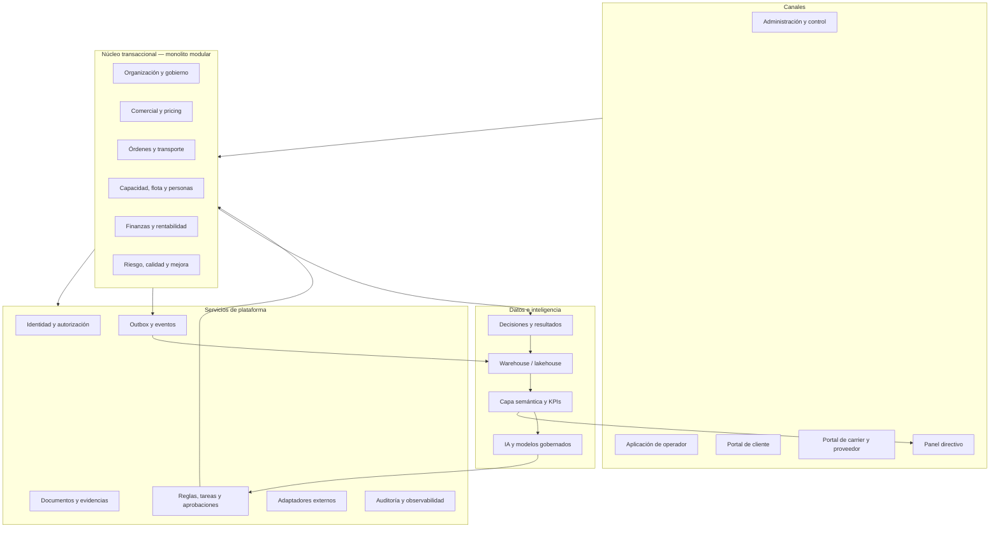

# Fleeter BOS — Business Operating System

Especificación maestra de un sistema operativo logístico, financiero y empresarial multiempresa, multi-país y multi-tenant. El BOS está diseñado para funcionar desde una sola unidad y evolucionar a una plataforma SaaS global sin convertir cada capacidad en un silo.

## Decisión de producto

El BOS no es una colección de módulos. Es una red de **cadenas de valor**, **registros transaccionales**, **eventos verificables**, **decisiones** y **resultados medidos**.

Toda capacidad incluida debe cumplir cinco condiciones:

1. Tener un usuario y una decisión que habilita.
2. Participar en una cadena de valor identificable.
3. Tener una fuente de verdad y un dueño del dato.
4. Emitir evidencia o eventos auditables.
5. Producir una métrica o resultado que permita mejorar el proceso.

## Aplicación web

El primer canal implementado es el portal de acceso de `apps/bos-web`, construido con Next.js y TypeScript. Corresponde al deployment unit **Web/admin/control tower** de la arquitectura técnica. Es una interfaz de acceso en modo demostración: valida el formulario localmente, muestra estados de carga y error, y deja explícito que todavía no autentica ni conserva sesiones.

```powershell
npm.cmd install --cache .npm-cache
npm.cmd run dev
```

## Índice de la especificación

| Documento | Propósito |
|---|---|
| [00 — Contrato del producto](docs/00-product-charter.md) | Visión, objetivos, personas, principios y alcance |
| [01 — Modelo operativo](docs/01-operating-model.md) | Cadenas de valor, responsables, decisiones y cadencias |
| [02 — Arquitectura funcional](docs/02-domain-architecture.md) | Contextos de negocio, capacidades y límites |
| [03 — Estados y reglas](docs/03-state-machines-and-rules.md) | Ciclos de vida, excepciones y controles operativos |
| [04 — Datos e inteligencia](docs/04-data-and-intelligence.md) | Fuentes de verdad, warehouse, semántica y aprendizaje |
| [05 — Catálogo de KPIs](docs/05-kpi-framework.md) | Fórmulas, dimensiones, decisiones y guardrails |
| [06 — Eventos e integraciones](docs/06-events-and-integrations.md) | Contrato de eventos, adaptadores y reconciliación |
| [07 — Seguridad y confiabilidad](docs/07-security-reliability-compliance.md) | SaaS global, privacidad, continuidad y cumplimiento |
| [08 — IA empresarial](docs/08-enterprise-ai.md) | Copilotos, modelos, controles y niveles de autonomía |
| [09 — Roadmap construible](docs/09-roadmap-and-acceptance.md) | Épicas, fases, gates y criterios de aceptación |
| [12 — Fase 1: Solicitud a Orden](docs/12-phase-1-request-to-order.md) | Contrato implementable del primer corte vertical de Fase 1 |
| [10 — Mapa de capacidades](docs/10-capability-map.md) | Cobertura completa de todas las áreas del negocio |
| [11 — Arquitectura técnica](docs/11-technical-reference-architecture.md) | Stack de referencia, escala, almacenamiento y despliegue |

## Catálogos operables

- [Entidades canónicas](catalogs/entity-catalog.csv)
- [Eventos de negocio](catalogs/event-catalog.csv)
- [Métricas y KPIs](catalogs/kpi-catalog.csv)

## Decisiones arquitectónicas

- [ADR-001 — Monolito modular](docs/adr/ADR-001-modular-monolith.md)
- [ADR-002 — Estados separados y eventos confiables](docs/adr/ADR-002-state-and-events.md)
- [ADR-003 — Multi-tenancy e aislamiento](docs/adr/ADR-003-multitenancy.md)
- [ADR-004 — Separación operacional y analítica](docs/adr/ADR-004-operational-analytical.md)

## Arquitectura resumida



## Regla de implementación

Ninguna historia se considera terminada si no incluye comportamiento normal, excepción, permiso, auditoría, dato emitido, métrica afectada y prueba de aceptación.
