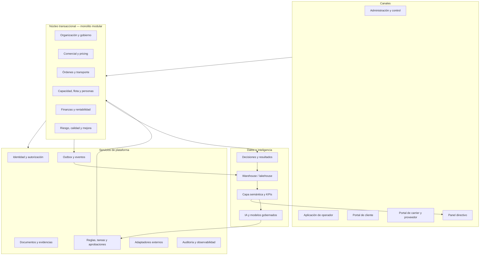

# Fleeter BOS — Business Operating System

Especificación maestra de un sistema operativo logístico, financiero y empresarial multiempresa, multi-país y multi-tenant. El BOS está diseñado para funcionar desde una sola unidad y evolucionar a una plataforma SaaS global sin convertir cada capacidad en un silo.

## Decisión de producto

El BOS no es una colección de módulos. Es una red de **cadenas de valor**, **registros transaccionales**, **eventos verificables**, **decisiones** y **resultados medidos**.

Toda capacidad incluida debe cumplir cinco condiciones:

1. Tener un usuario y una decisión que habilita.
2. Participar en una cadena de valor identificable.
3. Tener una fuente de verdad y un dueño del dato.
4. Emitir evidencia o eventos auditables.
5. Producir una métrica o resultado que permita mejorar el proceso.

## Estado de construcción

**Fase 0 — Fundación ejecutable: completa.** **Fase 1 — Solicitud a Orden:
completa.** **Fase 2 — Orden a Entrega: núcleo y API completos.** Una necesidad
de transporte se captura, se cotiza por versiones inmutables, se aprueba contra
una política configurable, se convierte en una orden comprometida y se ejecuta
como un viaje con recursos elegibles, paradas, entrega y evidencia — con
auditoría, eventos e idempotencia en cada transición.

La transición que define la Fase 2 es `Confirmed → Released`. El **gate de
liberación** de [docs/03 §4](docs/03-state-machines-and-rules.md) se evalúa como
regla y no como costumbre: devuelve las causas que impiden salir, no un "no".
Una unidad con la verificación vencida o una carga que no cabe detienen el viaje
antes del portón, y eximir de eso exige una excepción que **nombra la causa**
que autoriza.

| Componente | Estado |
|---|---|
| Esquema por contexto, RLS y roles sin `BYPASSRLS` | Operativo |
| Provisionamiento de tenant | Operativo |
| Invitar, activar, conceder y revocar accesos desde el producto | Operativo |
| Auditoría inmutable y outbox con envelope canónico | Operativo |
| Idempotencia de comandos y auditoría de rechazos | Operativo |
| Worker de publicación con backoff y cola de errores | Operativo |
| Autenticación real y espacio de trabajo por tenant | Operativo |
| Políticas versionadas con alcance (tenant, entidad legal, cliente) | Operativo |
| Cliente, contacto, ubicación, perfil de servicio y crédito | Operativo |
| Solicitud, cotización versionada, excepciones y orden comprometida | Operativo |
| API `/v1` con `Idempotency-Key`, `If-Match` y correlación | Operativo |
| Catálogos configurables por tenant | Operativo |
| Plantillas de documento con enlaces verificados | Operativo |
| Unidad, remolque, operador y credenciales con vigencia | Operativo |
| Carga, paradas, plan de ruta versionado y viaje | Operativo |
| Gate de liberación con causas y excepción por causa | Operativo |
| Ejecución de paradas, entrega derivada y evidencia | Operativo |
| Pantallas de viajes con el gate visible | Operativo |
| Contrato, versión contractual y tarifario inmutable | Operativo |
| Pantalla de Formatos: subir, enlazar, publicar y emitir | Operativo |
| Pantallas de flota y captura de carga, paradas y plan | Solo API |
| Cargos, factura, pago y margen final | Fase 3 |

## Estructura

```text
apps/bos-web/          Canal web y API /v1. Next.js hospeda el dominio, no lo contiene
packages/contracts/    Envelope de eventos, errores, permisos y esquemas de política
packages/domain/       Dominio puro: Money, máquinas de estado, autorización, reglas
packages/core/         Núcleo transaccional: BC-02 comercial y BC-03 transporte
packages/platform/     Infraestructura transversal: unidad de trabajo, auditoría,
                       outbox, idempotencia, políticas, excepciones, sesión
supabase/migrations/   Esquema versionado
scripts/               Verificación de entorno y provisionamiento
tests/                 Dominio (puro), integración (base real), API y arquitectura
```

`packages/core` separa los contextos de negocio en módulos con contrato propio.
BC-03 depende de BC-02 y nunca al revés: la cotización recibe la solicitud como
valor y jamás consulta su esquema. Esa dirección única —verificada por
[una prueba](tests/architecture/module-boundaries.test.ts), no solo documentada—
es lo que permitiría extraer uno de los dos del monolito sin reescribir el otro
([ADR-001](docs/adr/ADR-001-modular-monolith.md)).

`packages/domain` no depende de ningún framework. Next.js es solo el anfitrión
actual: extraer una API propia cuando haga falta ([docs/02 §6](docs/02-domain-architecture.md))
no exige reescribir una sola regla de negocio.

## Puesta en marcha

```powershell
npm.cmd install --cache .npm-cache
Copy-Item .env.example .env.local   # y rellenar
npm.cmd run check:connection        # verifica conexión y aislamiento
npm.cmd run dev
```

El alta del primer tenant y la gestión de credenciales están en
[runbook 00](docs/runbooks/00-entornos-y-credenciales.md). Para recorrer el ciclo
de negocio completo, [runbook 02](docs/runbooks/02-fase-1-solicitud-a-orden.md).

Un detalle que sorprende al arrancar: el propietario recibe `tenant_admin`, que
configura el tenant pero **no crea clientes, no cotiza y no aprueba**
([docs/12 §3](docs/12-phase-1-request-to-order.md) separa gobierno de operación).
Los roles operativos se conceden en **Espacio de trabajo → Equipo**, invitando
por correo; el propietario puede invitarse a sí mismo si opera solo. Esa
concesión queda auditada y no debilita la regla que de verdad protege: nadie
aprueba lo que él mismo solicitó, y esa mira a la persona, no al rol.

```powershell
npm.cmd run typecheck    # los cinco paquetes
npm.cmd test             # dominio, integración, API y arquitectura
npm.cmd run outbox:publish -- --loop
```

Las pruebas de integración no necesitan Supabase: `scripts/setup-local-db.sh`
deja el esquema completo en cualquier PostgreSQL local, y es lo mismo que hace
CI, que levanta uno efímero por ejecución.

Para revisar el sistema con datos dentro,
`npm.cmd run seed:demo` deja un tenant con cinco solicitudes —una por cada
estado que vale la pena mirar, incluido un margen bajo umbral y un crédito
bloqueado— y una invitación por rol
([runbook 00 §7](docs/runbooks/00-entornos-y-credenciales.md)).

## Configuración: catálogos y formatos

Dos cosas que en la mayoría de los sistemas exigen un desarrollador, aquí son
datos del tenant.

**Catálogos.** Tipo de servicio, tipo de equipo, mercancía, credencial,
evidencia, motivos y unidades de medida viven en `plt.catalog` y los edita quien
administra el tenant. No es cosmético: el gate de liberación compara el equipo
que pide la orden contra el del remolque, y con texto libre `"Caja seca 53"` y
`"caja seca 53'"` son distintos — un viaje legítimo detenido por una comilla.

Los catálogos **llegan vacíos a propósito**. Un tenant nuevo no recibe una flota
de ejemplo que después tenga que distinguir de la suya. La única excepción son
los vocabularios que no son del tenant sino del mundo: kilogramo, tonelada,
tarima.

**Formatos de documento.** El tenant sube su cotización o su contrato —con su
papelería y su redacción— y declara qué dato del sistema llena cada marcador.
El sistema los llena; no los redacta.

Tres reglas impiden que salga un documento con huecos o con datos inventados, y
las tres viven en la base y en el dominio, no en la pantalla:

1. **Un campo sin enlace impide publicar.** Si el formato trae `{{rfc_cliente}}`
   y nadie dijo de dónde sale, no se publica.
2. **Un enlace solo apunta a un dato que existe.** El catálogo de rutas lo
   publica el producto y refleja lo que el código sabe resolver; una prueba
   compara las dos listas para que no se separen en silencio.
3. **Un obligatorio vacío bloquea la emisión** y devuelve la lista exacta de lo
   que falta. No imprime hueco ni rellena por su cuenta. El texto para las
   ausencias legítimas lo escribe el tenant, y entonces es suyo.

Hay una cuarta regla, que llegó después de que una prueba la reclamara: **la
forma del dato tiene que coincidir con la forma en que el formato lo usa**. Un
tarifario son varias filas; escrito `{{tarifas}}` en lugar de
`{{#each tarifas}}…{{/each}}` el motor no tenía qué pegar, imprimía vacío y
reportaba el documento como emitido — un contrato firmado con el tarifario en
blanco. No se arregla adivinando una maquetación de tabla, sino deteniendo la
publicación y diciendo exactamente cómo se escribe.

El motor es sustitución pura: no hay modelo de lenguaje en el camino. Un
documento que se firma no se redacta por inferencia.

Hoy se pueden emitir **cotización**, **orden de transporte** y **contrato**.

Todo esto se configura en **Espacio de trabajo → Formatos**, sin escribir
código: se sube el archivo, se ven los marcadores que detectó —todos vacíos—, se
elige de dónde sale cada uno del catálogo publicado, se marca cuáles son
obligatorios, se publica y se emite contra un registro real para ver qué sale.
La pantalla no sugiere enlaces: `{{cliente}}` es la razón social casi siempre, y
ese "casi" es justo el motivo — el día que no lo fuera, saldría impreso y
firmado sin que nadie lo revisara.

Se aceptan `.html`, `.md` y `.txt`. **`.docx` y `.pdf` todavía no**: habría que
convertirlos, y una conversión que se equivoca no rompe el formato — cambia el
texto de un contrato sin que nadie lo note.

## API

El ciclo de negocio se opera por HTTP ([docs/12 §7](docs/12-phase-1-request-to-order.md)).
La interfaz web usa exactamente los mismos comandos, así que una integración no
recibe un sistema distinto del que ve un usuario.

```text
POST   /v1/customers                                  GET /v1/customers
POST   /v1/contacts                                   GET /v1/contacts?customer_id=
POST   /v1/locations                                  GET /v1/locations
POST   /v1/service-profiles                           GET /v1/service-profiles
PUT    /v1/customers/{id}/credit                      POST /v1/customers/{id}/credit

POST   /v1/service-requests                           GET /v1/service-requests
GET    /v1/service-requests/{id}                      PATCH /v1/service-requests/{id}
POST   /v1/service-requests/{id}/submit
POST   /v1/service-requests/{id}/request-information
POST   /v1/service-requests/{id}/accept
POST   /v1/service-requests/{id}/cancel

POST   /v1/quotes                                     GET /v1/quotes/{id}
POST   /v1/quotes/{id}/cost
POST   /v1/quotes/{id}/request-approval
POST   /v1/quotes/{id}/approve
POST   /v1/quotes/{id}/reject-approval
POST   /v1/quotes/{id}/send
POST   /v1/quotes/{id}/decision

POST   /v1/transport-orders                           GET /v1/transport-orders/{id}

POST   /v1/contracts                                  GET /v1/contracts?customer_id=
POST   /v1/contracts/{id}/versions                    GET /v1/contracts/{id}/versions
GET    /v1/contract-versions/{id}
POST   /v1/contract-versions/{id}/advance
POST   /v1/contract-versions/{id}/activate
POST   /v1/contract-versions/{id}/terminate

POST   /v1/vehicles     /v1/trailers    /v1/drivers    /v1/credentials
POST   /v1/vehicles/{id}/block                        POST /v1/vehicles/{id}/release

POST   /v1/transport-orders/{id}/shipments
POST   /v1/transport-orders/{id}/stops
POST   /v1/transport-orders/{id}/route-plans          POST /v1/route-plans/{id}/activate

POST   /v1/trips                                      GET /v1/trips/{id}
POST   /v1/trips/{id}/assign                          POST /v1/trips/{id}/confirm-assignment
GET    /v1/trips/{id}/release-check                   POST /v1/trips/{id}/release
POST   /v1/trips/{id}/start                           POST /v1/trips/{id}/close
GET    /v1/trips/{id}/stops                           GET  /v1/trips/{id}/evidence

POST   /v1/stop-executions/{id}/arrive                POST /v1/stop-executions/{id}/outcome
POST   /v1/evidence-requirements/{id}/submit          POST /v1/evidence-requirements/{id}/waive
POST   /v1/evidence-submissions/{id}/accept           POST /v1/evidence-submissions/{id}/reject
```

Cuatro respuestas que sorprenden y son deliberadas:

- `POST /v1/contract-versions/{id}/advance` **rechaza** `Active` y `Terminated`.
  Cada uno arrastra obligaciones que esa transición genérica no comprueba —firma,
  vigencia y tarifas el primero; motivo el segundo— y cada uno tiene su endpoint.

- `POST /v1/trips/{id}/release` devuelve **200 con `released: false`** y la lista
  de causas cuando el gate no pasa. La petición fue válida; lo que falta es un
  dato o un permiso, no un reintento.
- `POST /v1/stop-executions/{id}/outcome` **no acepta el desenlace**. Se deriva
  de las cantidades: aceptarlo permitiría marcar "completa" una parada con seis
  tarimas faltantes ([docs/03 §14.5](docs/03-state-machines-and-rules.md)).
- Las cantidades y capacidades viajan como **cadena decimal**, igual que el
  dinero. El gate compara peso contra capacidad, y esa comparación no puede
  depender de cómo `JSON.parse` redondeó un double.

Toda escritura exige `Idempotency-Key`; un reintento devuelve la respuesta
original y responde `Idempotent-Replay: true`. `If-Match` lleva la revisión que
el `GET` devolvió como `ETag`. `X-Correlation-Id` se propaga o se genera, y
aparece en la respuesta, en la auditoría y en cada evento emitido.

## Índice de la especificación

| Documento | Propósito |
|---|---|
| [00 — Contrato del producto](docs/00-product-charter.md) | Visión, objetivos, personas, principios y alcance |
| [01 — Modelo operativo](docs/01-operating-model.md) | Cadenas de valor, responsables, decisiones y cadencias |
| [02 — Arquitectura funcional](docs/02-domain-architecture.md) | Contextos de negocio, capacidades y límites |
| [03 — Estados y reglas](docs/03-state-machines-and-rules.md) | Ciclos de vida, excepciones y controles operativos |
| [04 — Datos e inteligencia](docs/04-data-and-intelligence.md) | Fuentes de verdad, warehouse, semántica y aprendizaje |
| [05 — Catálogo de KPIs](docs/05-kpi-framework.md) | Fórmulas, dimensiones, decisiones y guardrails |
| [06 — Eventos e integraciones](docs/06-events-and-integrations.md) | Contrato de eventos, adaptadores y reconciliación |
| [07 — Seguridad y confiabilidad](docs/07-security-reliability-compliance.md) | SaaS global, privacidad, continuidad y cumplimiento |
| [08 — IA empresarial](docs/08-enterprise-ai.md) | Copilotos, modelos, controles y niveles de autonomía |
| [09 — Roadmap construible](docs/09-roadmap-and-acceptance.md) | Épicas, fases, gates y criterios de aceptación |
| [12 — Fase 1: Solicitud a Orden](docs/12-phase-1-request-to-order.md) | Contrato implementable del primer corte vertical de Fase 1 |
| [13 — Fase 2: Orden a Entrega](docs/13-phase-2-order-to-delivery.md) | Contrato implementable del corte de ejecución, con el gate de liberación |
| [10 — Mapa de capacidades](docs/10-capability-map.md) | Cobertura completa de todas las áreas del negocio |
| [11 — Arquitectura técnica](docs/11-technical-reference-architecture.md) | Stack de referencia, escala, almacenamiento y despliegue |

## Catálogos operables

- [Entidades canónicas](catalogs/entity-catalog.csv)
- [Eventos de negocio](catalogs/event-catalog.csv)
- [Métricas y KPIs](catalogs/kpi-catalog.csv)

## Decisiones arquitectónicas

- [ADR-001 — Monolito modular](docs/adr/ADR-001-modular-monolith.md)
- [ADR-002 — Estados separados y eventos confiables](docs/adr/ADR-002-state-and-events.md)
- [ADR-003 — Multi-tenancy e aislamiento](docs/adr/ADR-003-multitenancy.md)
- [ADR-004 — Separación operacional y analítica](docs/adr/ADR-004-operational-analytical.md)

## Arquitectura resumida



## Regla de implementación

Ninguna historia se considera terminada si no incluye comportamiento normal, excepción, permiso, auditoría, dato emitido, métrica afectada y prueba de aceptación.
