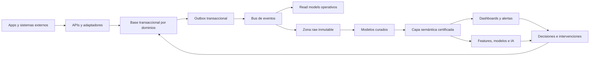

# 04 — Arquitectura de datos e inteligencia

## 1. Objetivo

El BOS debe responder qué ocurrió, qué debería ocurrir, qué se desvía, cuánto cuesta, por qué, quién debe intervenir y si la intervención funcionó. Para ello separa registro transaccional, eventos, analítica y decisión sin perder trazabilidad.

## 2. Capas de datos



### 2.1 Registro transaccional

- Base relacional ACID.
- Esquema lógico por contexto.
- Restricciones, claves y versiones aplicadas en base y dominio.
- Lecturas operativas mediante proyecciones; no consultas analíticas intensivas sobre OLTP.

### 2.2 Eventos

- Outbox escrita en la misma transacción que el cambio.
- Publicación al bus al menos una vez.
- Consumidores idempotentes.
- Esquemas versionados y compatibles.
- Zona raw conserva el evento original para reconstrucción y auditoría.

### 2.3 Contenido no estructurado

- Object storage con cifrado, hash, clasificación, versión, retención y escaneo.
- Metadatos estructurados en el BOS.
- OCR/extracción genera propuestas; el archivo original permanece como evidencia.

### 2.4 Plataforma analítica

- Warehouse/lakehouse desacoplado del núcleo.
- Transformaciones probadas y versionadas.
- Modelos dimensionales para análisis y data products para dominios especializados.
- Capa semántica única para KPIs, dimensiones, seguridad y moneda.

## 3. Campos canónicos universales

Toda entidad transaccional incluye, cuando aplique:

| Campo | Regla |
|---|---|
| `tenant_id` | Obligatorio, inmutable y validado por la sesión |
| `id` | UUID/ID global interno; nunca reutilizado |
| `legal_entity_id` | Empresa responsable del hecho |
| `version` | Control optimista y orden del agregado |
| `status` | Valor de máquina publicada |
| `effective_at` | Momento en que el hecho aplica al negocio |
| `occurred_at` | Momento en que ocurrió |
| `recorded_at` | Momento en que el BOS lo recibió |
| `timezone` | Zona local cuando el evento depende de horario |
| `source_system` | Sistema o canal de origen |
| `source_reference` | Identificador externo sin usarlo como PK |
| `created_by/updated_by` | Actor humano, servicio o regla |
| `correlation_id` | Cadena de trazabilidad end-to-end |
| `data_quality_status` | valid, warning, quarantined o rejected |
| `classification` | Pública, interna, confidencial o restringida |

## 4. Fuentes de verdad

| Concepto | Fuente transaccional | Validación/reconciliación |
|---|---|---|
| Cliente y contrato | Comercial | Documentos firmados y ERP fiscal |
| Solicitud y orden | Transporte | Referencia cliente/EDI/API |
| Viaje y paradas | Transporte | App, control tower y tracking |
| Posición GPS | Tracking normalizado | Proveedor, dispositivo, geocerca y calidad |
| Elegibilidad de activo | Capacidad | Mantenimiento, documentos, inspección y asignación |
| Elegibilidad de operador | Capacidad | RH, credenciales, turno y seguridad |
| Evidencia | Transporte + contenido | Reglas del contrato y revisión |
| Cargo facturable | Finanzas | Tarifa/contrato y hechos operativos |
| Factura | Finanzas o adaptador fiscal | Respuesta fiscal/XML |
| Pago | Tesorería | Movimiento bancario aplicado |
| Costo real | Subledger operativo | Factura, ticket, banco, inventario o devengo |
| Contabilidad legal | ERP/ledger definido por tenant | Interface y conciliación de control |
| KPI certificado | Capa semántica | Pruebas, owner y versión aprobada |

## 5. Modelo analítico

### Dimensiones conformadas

- `dim_tenant`
- `dim_legal_entity`
- `dim_date`, `dim_time`, `dim_timezone`
- `dim_customer`, `dim_contract`
- `dim_location`, `dim_lane`, `dim_route`
- `dim_vehicle`, `dim_equipment`, `dim_carrier`
- `dim_driver`, con controles de privacidad y acceso
- `dim_service`, `dim_cargo_type`
- `dim_vendor`, `dim_part`
- `dim_currency`, `dim_unit_of_measure`
- `dim_rule_version`, `dim_metric_version`

Dimensiones mutables relevantes usan Slowly Changing Dimension tipo 2 para conservar vigencia histórica.

### Hechos principales y grano

| Hecho | Grano exacto |
|---|---|
| `fact_quote` | Una versión de cotización |
| `fact_transport_order` | Una orden de transporte |
| `fact_trip` | Un viaje ejecutado o cancelado |
| `fact_trip_stop` | Una parada de un viaje |
| `fact_shipment_item` | Un artículo/línea transportada por orden y entrega |
| `fact_tracking_event` | Un evento normalizado de tracking |
| `fact_resource_day` | Un recurso por día local |
| `fact_driver_shift` | Un operador por turno |
| `fact_fuel_transaction` | Una carga/transacción de combustible |
| `fact_maintenance_work_order` | Una orden de trabajo |
| `fact_cost` | Un costo, etapa, fuente y objeto asignado |
| `fact_billable_charge` | Un cargo facturable |
| `fact_invoice_line` | Una línea de factura emitida |
| `fact_payment_application` | Aplicación de pago a documento |
| `fact_inventory_movement` | Un movimiento de artículo/lote |
| `fact_case` | Un caso/incidencia/reclamo |
| `fact_capa_action` | Una acción correctiva |
| `fact_decision` | Una decisión material |
| `fact_intervention_outcome` | Resultado medido de una intervención |
| `fact_saas_usage` | Tenant, entitlement y periodo de medición |

## 6. Tiempo, moneda y unidades

- Almacenar timestamps en UTC y conservar zona local aplicable.
- Ventanas operativas se evalúan en zona de la ubicación, incluyendo cambios estacionales.
- Conservar moneda transaccional, moneda funcional, tipo de cambio, fuente y timestamp.
- No recalcular retrospectivamente resultados oficiales con un tipo de cambio nuevo; generar nueva vista/version.
- Normalizar distancia, volumen, masa, temperatura y combustible a unidades base, conservando valor original.

## 7. Gobierno de datos

### Roles

| Rol | Responsabilidad |
|---|---|
| Data owner | Define propósito, acceso, calidad y uso permitido |
| Data steward | Mantiene definición, catálogo y resolución de defectos |
| System owner | Asegura captura, disponibilidad e integridad técnica |
| Metric owner | Define interpretación, decisión y revisión del KPI |
| Control owner | Verifica que el dato soporte el control requerido |
| Privacy/security owner | Define clasificación, retención y protección |

### Contrato de dato

Todo data product o evento crítico declara:

- Nombre, descripción y dueño.
- Esquema y semántica de campos.
- Grano y claves.
- Fuente y linaje.
- Frecuencia, latencia y disponibilidad.
- Reglas de completitud, validez y unicidad.
- Clasificación y propósito permitido.
- Política de cambios y compatibilidad.
- SLO y procedimiento de incidente.

## 8. Calidad de datos

### Dimensiones

- Completitud.
- Validez.
- Unicidad.
- Consistencia.
- Oportunidad/freshness.
- Exactitud contra fuente externa.
- Integridad referencial.
- Trazabilidad.

### Tratamiento

| Resultado | Acción |
|---|---|
| Valid | Procesar y certificar |
| Warning | Procesar con bandera y posible exclusión analítica |
| Quarantined | No afectar decisiones automáticas; enviar a resolución |
| Rejected | No aceptar transacción; explicar corrección |

### Reconciliaciones críticas

1. Solicitud ↔ orden ↔ viaje.
2. Viaje ↔ paradas ↔ tracking ↔ evidencia.
3. Viaje ↔ cargos ↔ factura.
4. Factura ↔ cuenta por cobrar ↔ pago ↔ banco.
5. Compra ↔ recepción ↔ factura proveedor ↔ pago.
6. Combustible ↔ tarjeta ↔ ticket ↔ factura ↔ GPS/odómetro.
7. Inventario ↔ consumo ↔ mantenimiento ↔ contabilidad.
8. Subledger BOS ↔ ERP contable.

## 9. Capa semántica

Cada métrica contiene:

- ID y versión.
- Nombre de negocio y descripción.
- Fórmula declarativa.
- Numerador, denominador y exclusiones.
- Grano, dimensiones y ventanas.
- Fecha utilizada: ocurrencia, servicio, emisión, vencimiento o pago.
- Fuente y freshness.
- Owner y aprobadores.
- Estado: draft, validated, certified, deprecated.
- Guardrails y posibles sesgos.
- Decisiones que puede y no puede soportar.

Las visualizaciones solo consultan métricas certificadas. Los análisis ad hoc se marcan como exploratorios.

## 10. Ciclo de inteligencia

```text
Hecho validado
→ métrica certificada
→ señal o desviación
→ hipótesis
→ decisión
→ acción/intervención
→ resultado con ventana de evaluación
→ aprendizaje
→ cambio versionado de regla/proceso/modelo
```

No se atribuye causalidad solo porque una métrica cambió después de una acción. El registro conserva factores externos, comparador y confianza.

## 11. Data readiness para predicción e IA

Un caso de uso avanza a modelado cuando:

- El resultado objetivo está definido y observable.
- Existe una regla simple de comparación.
- La cobertura y calidad superan el umbral aprobado.
- La muestra representa rutas, temporadas y condiciones relevantes.
- El uso de atributos personales es legal, necesario y revisado.
- Existe owner para actuar sobre el resultado.
- El valor de una mejor predicción supera costo y riesgo.
- Se definieron monitoreo, drift, override y rollback.

## 12. Retención y ciclo de vida

La retención se configura por país, tenant, tipo documental, obligación y propósito. Al vencer:

- conservar cuando exista obligación o litigio hold;
- anonimizar cuando el análisis pueda continuar sin identidad;
- eliminar de forma verificable cuando no exista base para conservar;
- propagar la decisión a réplicas, índices y almacenes derivados según política.

