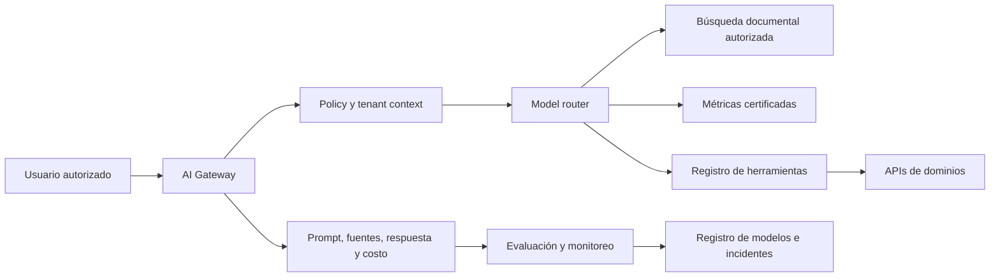

# 08 — IA empresarial gobernada

## 1. Propósito

La IA del BOS explica, propone y ejecuta herramientas autorizadas; no sustituye la fuente transaccional, la capa semántica ni la responsabilidad humana.

## 2. Arquitectura



## 3. Componentes

- **AI Gateway:** identidad, tenant, límites, redacción, routing y trazabilidad.
- **Model router:** selecciona modelo por sensibilidad, tarea, costo, latencia y región.
- **Tool registry:** comandos con esquema, permiso, riesgo, idempotencia y aprobación.
- **Semantic access:** KPIs certificados con versión y timestamp.
- **RAG/document search:** contenido permitido, citas y protección contra instrucciones incrustadas.
- **Model/use-case registry:** owner, modelo, versión, evaluación, riesgo y estado.
- **Evaluation service:** pruebas offline, shadow, monitoreo, feedback y regresiones.
- **Policy engine:** autonomía, datos permitidos, acciones prohibidas y escalamiento.

## 4. Asistentes

### Ejecutivo

- Explicar variaciones con métricas certificadas.
- Identificar drivers, riesgos y decisiones abiertas.
- Comparar escenarios y supuestos.
- Preparar el registro de decisión; nunca presentar correlación como causalidad confirmada.

### Operativo

- Buscar viajes y resumir turno.
- Explicar retrasos usando tracking, ventanas e incidencias.
- Proponer asignaciones factibles.
- Preparar caso, comunicación o plan de contingencia.
- Ejecutar tareas reversibles dentro de política.

### Comercial

- Resumir cliente, volumen, servicio, riesgo y rentabilidad.
- Preparar cotización desde supuestos explícitos.
- Señalar pérdida de precio, capacidad o crédito.
- Redactar seguimiento sin inventar compromisos.

### Financiero

- Explicar margen, cash flow, cartera y variaciones.
- Priorizar cobranza con reglas transparentes.
- Proponer matching de pagos y anomalías.
- Preparar escenarios sin contabilizarlos automáticamente.

### Flota, seguridad y calidad

- Resumir salud del activo y próximos riesgos.
- Explicar anomalías de combustible.
- Agrupar causas recurrentes.
- Preparar CAPA y verificar evidencia; no sancionar personas.

### Documental

- Extraer campos de facturas, POD, tickets, contratos, licencias y pólizas.
- Mostrar archivo, página/región, valor, confianza y validación.
- Mantener revisión humana para campos financieros, fiscales o de cumplimiento según umbral.

## 5. Niveles de autonomía

| Nivel | Capacidad | Ejemplos |
|---|---|---|
| A0 | Recuperar y explicar | Buscar viaje, mostrar KPI, citar contrato |
| A1 | Recomendar | Proponer ruta, precio, prioridad o acción |
| A2 | Preparar borrador | Cotización, incidencia, correo, orden de trabajo |
| A3 | Ejecutar reversible dentro de política | Crear tarea, solicitar evidencia, notificar, etiquetar |
| A4 | Ejecutar sensible con aprobación explícita | Bloqueo, cambio de tarifa, factura, pago, contrato |

Quedan prohibidas de forma autónoma: pagos, cuentas bancarias, sanciones laborales, terminación contractual, eliminación de datos, cambios de permisos privilegiados y declaraciones fiscales.

## 6. Contrato de una respuesta

Toda respuesta material muestra o registra:

- Tenant, usuario y propósito.
- Datos utilizados y timestamp.
- Métricas y versiones.
- Documentos citados.
- Supuestos y datos faltantes.
- Confianza o incertidumbre apropiada.
- Modelo y versión.
- Acción propuesta.
- Impacto y riesgos.
- Aprobación requerida.
- Resultado de la acción y feedback posterior.

## 7. Ciclo de vida de un caso de uso

```text
Propuesta → evaluación de valor/riesgo → data readiness
→ baseline simple → pruebas offline → revisión
→ shadow mode → piloto limitado → producción controlada
→ monitoreo → expansión/restricción → retiro
```

### Gate de producción

- Owner de negocio y técnico.
- Resultado que puede medirse.
- Dataset representativo y documentado.
- Baseline y umbral de mejora.
- Pruebas de exactitud, seguridad, privacidad y sesgo.
- Casos negativos y red-team.
- Human override y fallback.
- Monitoreo de costo, latencia, calidad y drift.
- Runbook e interruptor de apagado.

## 8. Riesgos y controles

| Riesgo | Control |
|---|---|
| Alucinación | Fuentes obligatorias, respuestas estructuradas y abstención |
| Fuga entre tenants | Contexto de tenant no controlado por prompt, filtros en herramienta y pruebas |
| Prompt injection | Contenido externo no confiable, aislamiento de instrucciones y allowlist de herramientas |
| Acción incorrecta | Simulación, preview, aprobación, idempotencia y compensación |
| Sesgo contra personas | Atributos permitidos, evaluación segmentada, revisión y apelación |
| Datos obsoletos | Freshness visible y bloqueo de recomendación cuando excede SLA |
| Dependencia de proveedor | Router, portabilidad de prompts/evals y fallback |
| Costo descontrolado | Cuotas por tenant, cache seguro y modelo proporcional a tarea |
| Automatización complaciente | Mostrar alternativa, incertidumbre y guardrails |

## 9. Evaluación

### Métricas técnicas

- Grounded answer rate.
- Exactitud de extracción por campo.
- Tool-call success rate.
- Latencia p95 y costo por tarea.
- Tasa de abstención correcta.
- Violaciones de política.

### Métricas de negocio

- Tiempo ahorrado verificado.
- Error/retrabajo antes y después.
- Recommendation acceptance y override.
- Valor incremental contra baseline.
- Incidentes, reclamos o sesgo por segmento.
- Porcentaje de recomendaciones cuyo resultado fue evaluado.

La aceptación de una recomendación no prueba que fue correcta; su valor se determina por el resultado posterior.

## 10. Feature store y modelos

- Features con owner, entidad, ventana temporal, fórmula y freshness.
- Training/serving parity.
- Point-in-time correctness para evitar leakage.
- Modelo, datos, código y parámetros versionados.
- Champion/challenger cuando exista volumen.
- Drift de entrada, rendimiento y resultado.
- Reentrenamiento solo tras evaluación, no por calendario automático.

## 11. Casos de uso por madurez

### Inmediatos, sin ML propio

- Búsqueda y resumen con permisos.
- Extracción documental asistida.
- Explicación de KPIs certificados.
- Redacción y clasificación de casos.

### Tras calidad transaccional

- ETA y riesgo de retraso.
- Anomalías de combustible/gasto.
- Riesgo de cobranza.
- Recomendación de asignación y precio.

### Tras escala y evidencia

- Demanda y capacidad.
- Mantenimiento predictivo.
- Gemelo digital y optimización multiobjetivo.
- Agentes con autonomía limitada y controles por política.

