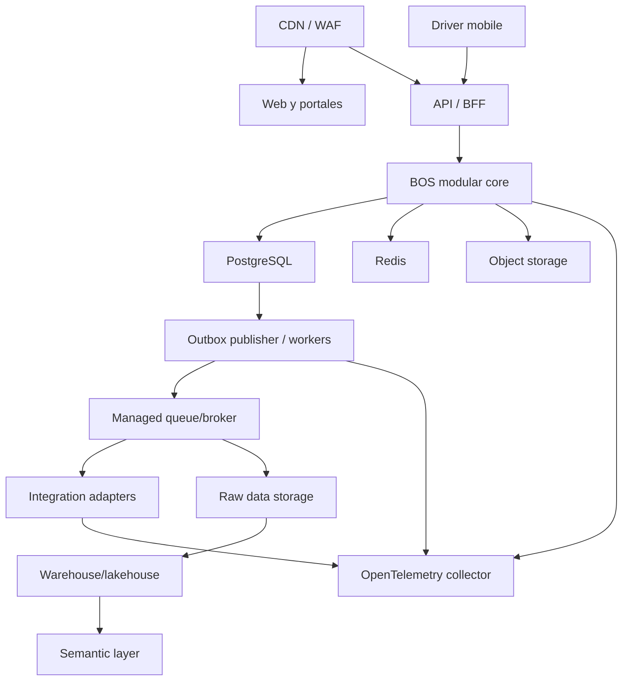

# 11 — Arquitectura técnica de referencia

## 1. Decisión de stack

La arquitectura lógica es obligatoria; las marcas pueden sustituirse mediante ADR si el equipo demuestra compatibilidad con contratos, seguridad, latencia, costo y operación.

### Stack recomendado para el inicio

| Capa | Elección de referencia | Motivo |
|---|---|---|
| Web | TypeScript + React/Next.js | Productividad, SSR/SPA y ecosistema empresarial |
| Mobile | React Native + base SQLite cifrada | Reutilización de tipos y operación offline |
| API/núcleo | TypeScript + NestJS o framework modular equivalente | Módulos, validación, DI, APIs y equipo pequeño |
| OLTP | PostgreSQL administrado | ACID, integridad, JSON controlado, partición y RLS |
| Cache/ephemeral | Redis administrado | Cache, rate limits, presencia y coordinación breve |
| Archivos | Object storage compatible con S3 | Durabilidad, lifecycle, URLs firmadas y escala |
| Async inicial | Outbox PostgreSQL + workers/cola administrada | Entrega confiable sin operar Kafka prematuramente |
| Event streaming a escala | Broker Kafka-compatible administrado | Particiones, replay y alto volumen cuando sea necesario |
| Analítica | Object storage raw + warehouse/lakehouse administrado + dbt/equivalente | Historia, transformación probada y BI desacoplado |
| Observabilidad | OpenTelemetry + backend administrado | Trazas, métricas y logs portables |
| Identidad | IdP administrado con OIDC/SAML/SCIM | Seguridad y enterprise federation |
| Infraestructura | Contenedores administrados + IaC | Menor operación que Kubernetes inicial |
| IA | AI gateway propio + proveedores intercambiables | Tenant safety, policy, evaluación y control de costo |

PostgreSQL RLS se usa como segunda barrera, además de la autorización del dominio; no protege por sí solo jobs, caches, archivos ni sistemas analíticos. OpenTelemetry mantiene instrumentación portable entre proveedores.

Referencias: [PostgreSQL Row Security](https://www.postgresql.org/docs/current/ddl-rowsecurity.html) y [OpenTelemetry](https://opentelemetry.io/docs/).

## 2. Topología inicial

## 3. Deployment units iniciales

1. Web/admin/control tower.
2. API y núcleo modular.
3. Worker de outbox y procesos asíncronos.
4. Tracking ingest adapter.
5. Integration workers por riesgo/latencia.
6. Data ingestion/transformations.

No se crea un deployment por dominio. Se aíslan workers que puedan saturarse, fallar por tercero o requerir scaling distinto.

## 4. Almacenamiento

### PostgreSQL

- Esquema lógico por contexto.
- Primary keys globales e índices prefijados por tenant cuando corresponda.
- Foreign keys dentro de contexto; referencias inter-contexto por ID y contrato.
- Partición para eventos/tracking/auditoría cuando el volumen lo requiera.
- Read replicas para reporting operacional no crítico.
- Backups point-in-time y restauración probada.

### Redis

Permitido para:

- Cache de lectura con TTL.
- Rate limits y cuotas.
- Sesiones/presencia cuando el IdP lo requiera.
- Locks breves con fallback seguro.

Prohibido como única fuente de estado, dinero, autorización, workflow o idempotencia crítica.

### Object storage

- Ruta lógica incluye tenant y clasificación, sin confiar solo en el nombre.
- Metadata, hash y permiso en PostgreSQL.
- Versioning/lifecycle y legal hold cuando aplique.
- Malware scan antes de publicación.

### Warehouse/lakehouse

- Raw append-only.
- Staging validado.
- Curated facts/dimensions.
- Semantic metrics.
- Separación de cómputo por workload/tenant tier cuando se requiera.

## 5. Cache strategy

- Cache-aside para catálogos y vistas de lectura.
- Keys incluyen tenant, resource, version y alcance.
- Invalidación por evento o TTL corto.
- No cachear decisiones sensibles sin versión de política.
- Stampede protection en datos costosos.
- La UI muestra freshness para datos no transaccionales.

## 6. Concurrencia e idempotencia

- `version` optimista en agregados.
- Idempotency table transaccional para comandos externos.
- Unique constraints de negocio por tenant.
- Outbox con event_id único.
- Consumer inbox/dedup para efectos sensibles.
- Pagos, facturas y webhooks usan claves externas más idempotency key.

## 7. Escala

### Envelopes de diseño

| Tier | Carga de referencia | Arquitectura |
|---|---|---|
| T0 | 1–100 vehículos; <100 eventos/s | Núcleo y PostgreSQL compartidos; queue administrada |
| T1 | Hasta 10k vehículos; ~2k eventos/s pico | Tracking workers separados; partición; broker y warehouse dedicados |
| T2 | Hasta 250k vehículos; ~25k eventos/s pico | Pipeline regional de tracking; partición por tenant/asset; storage analítico especializado |

Son envelopes de prueba, no proyecciones comerciales. Deben recalibrarse con frecuencia de GPS, payload, retención y patrones reales.

### Señales para escalar

- p95 o backlog excede SLO de forma sostenida.
- Noisy neighbor afecta otros tenants.
- Dataset supera ventana eficiente de mantenimiento/backup.
- Costo marginal exige storage/computación especializada.
- Requisito de residencia o aislamiento.

## 8. Multi-region

- Cada tenant tiene `home_region` y política de residencia.
- Escrituras críticas permanecen en una región primaria por tenant.
- CDN y canales pueden ser globales.
- Failover regional se ensaya y documenta; no se promete active-active transaccional antes de necesitarlo.
- Catálogos globales se replican; datos restringidos respetan residencia.
- DR no puede mezclar tenants ni perder las claves de cifrado requeridas.

## 9. Error handling

### Síncrono

- Validación antes de efecto.
- Errores de negocio estables 4xx; fallas internas 5xx con correlation ID.
- Timeout menor al timeout del caller.
- No reintentar desde múltiples capas sin presupuesto coordinado.

### Asíncrono

- Retry solo para errores transitorios.
- Backoff y jitter.
- DLQ para fallas persistentes.
- Compensación para efectos parciales.
- Runbook y owner por cola.
- Replay con dry-run y filtro por tenant/evento.

## 10. CI/CD y entornos

- Pull request con pruebas unitarias, dominio, contratos, integración, seguridad y arquitectura.
- Entornos local, test, staging y production; sandbox externo cuando aplique.
- Infraestructura y políticas como código.
- Migración compatible antes del código que la requiere.
- Feature flags por tenant/cohorte.
- Canary/progressive rollout y rollback.
- Datos de producción no se copian sin sanitización.

## 11. Pruebas obligatorias

- Unitarias de reglas y estados.
- Contract tests de APIs/eventos/adaptadores.
- Integración con base real.
- End-to-end de cadenas críticas.
- Property-based para pricing, asignación y money.
- Cross-tenant negatives.
- Concurrencia e idempotencia.
- Offline/conflict/replay móvil.
- Performance y soak de tracking.
- Restore, failover y reconciliación.
- Seguridad y permisos.
- Data quality y metric regression.

## 12. Build vs buy

### Construir

- Orquestación logística y estados.
- Pricing conectado a costo/capacidad.
- Cierre económico por viaje.
- Control tower y aprendizaje.
- Capa semántica propia del negocio.
- AI gateway y tool policies del BOS.

### Integrar preferentemente

- IdP/SSO.
- Mapas, tráfico y geocoding.
- CFDI/fiscal por jurisdicción.
- Bancos/pagos.
- Email, SMS y WhatsApp.
- Firma electrónica.
- Nómina y contabilidad legal.
- Proveedores GPS/telemática.

### Evaluar por escala

- Workflow engine especializado.
- Broker streaming.
- Search engine dedicado.
- Feature store.
- Optimización avanzada.

## 13. Decisiones técnicas por confirmar antes de implementación

| Decisión | Owner | Bloqueante |
|---|---|---|
| Cloud y regiones iniciales | Engineering/Security | Sí para infraestructura |
| Framework backend según experiencia del equipo | Engineering | Sí para repositorio |
| ERP, nómina, CFDI, banco y GPS existentes | Product/Finance | Sí para adaptadores Wave 1 |
| IdP empresarial | Security/Engineering | Sí para identidad |
| Warehouse administrado | Data/Engineering | No para primer prototipo; sí antes de producción analítica |
| Requisitos de residencia y clientes objetivo | Legal/Product | Sí antes de vender globalmente |

